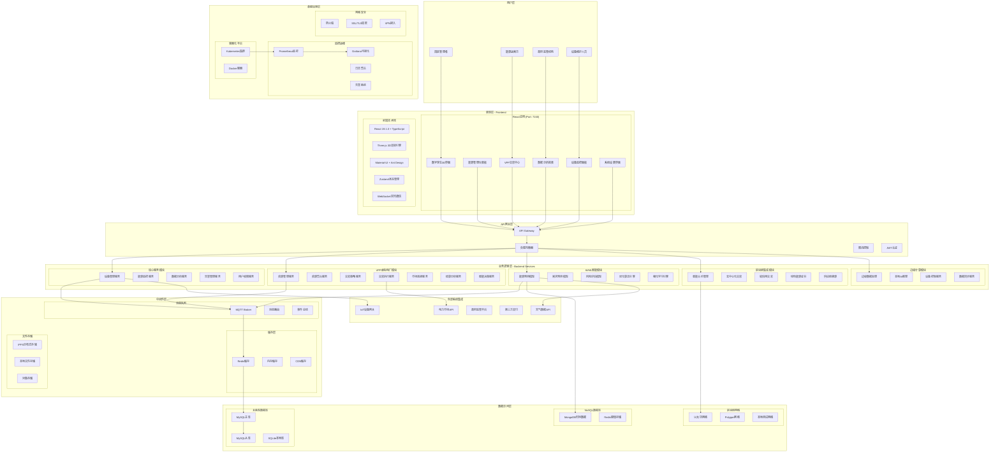

# 零碳园区数字孪生系统 - 系统架构设计

## 架构总览

零碳园区数字孪生系统采用**微服务架构 + 前后端分离 + 消息队列**的现代化架构模式，结合**分层架构设计**，实现高可用、高性能、可扩展的智慧园区管理平台。

### 架构特点

- **微服务架构**：模块化设计，服务独立部署和扩展
- **前后端分离**：React前端 + Node.js后端，职责清晰
- **消息驱动**：MQTT消息队列实现异步通信和事件驱动
- **分层设计**：表现层、业务逻辑层、数据访问层清晰分离
- **云原生**：容器化部署，支持Kubernetes编排

## 系统架构图



## 核心模块拆解

### 1. 表现层 (Frontend Layer)

#### 1.1 数字孪生3D模块
- **职责**：提供沉浸式3D园区可视化体验
- **技术栈**：Three.js + React Three Fiber + WebGL
- **核心功能**：
  - 3D场景渲染和交互
  - 实时数据可视化
  - 虚拟漫游和导航
  - AR/VR预备支持

#### 1.2 能源管理仪表板
- **职责**：实时能源数据监控和分析
- **技术栈**：React + Recharts + Material-UI
- **核心功能**：
  - 实时能源消耗监控
  - 能源效率分析
  - 碳排放计算
  - 预测性分析

#### 1.3 VPP交易中心
- **职责**：虚拟电厂运营和电力交易管理
- **技术栈**：React + Ant Design + WebSocket
- **核心功能**：
  - 资源聚合管理
  - 交易策略配置
  - 实时交易执行
  - 收益分析报告

### 2. API网关层 (API Gateway Layer)

#### 2.1 API网关 (ApiGateway.js)
- **职责**：统一API入口，路由分发和服务治理
- **核心功能**：
  - 请求路由和负载均衡
  - API版本管理
  - 限流和熔断
  - 监控和日志

#### 2.2 认证授权中间件
- **职责**：用户身份验证和权限控制
- **技术实现**：JWT + RBAC
- **核心功能**：
  - 用户登录认证
  - 角色权限管理
  - API访问控制
  - 会话管理

### 3. 业务逻辑层 (Business Logic Layer)

#### 3.1 设备管理服务 (DeviceManagementService)
- **职责**：园区设备的全生命周期管理
- **核心功能**：
  - 设备注册和配置
  - 设备状态监控
  - 设备控制指令
  - 设备维护管理

#### 3.2 VPP虚拟电厂服务群

##### VPPResourceService
- **职责**：分布式能源资源管理
- **核心功能**：
  - 资源模板定义
  - 资源实例管理
  - 资源状态监控
  - 资源性能分析

##### VPPTradingService
- **职责**：电力交易执行和管理
- **核心功能**：
  - 交易策略执行
  - 市场数据获取
  - 订单管理
  - 风险控制

##### VPPIntelligentDecisionService
- **职责**：AI驱动的智能决策
- **核心功能**：
  - 智能交易决策
  - 资源优化配置
  - 风险评估
  - 收益优化

#### 3.3 AI/ML智能服务群

##### EnergyPredictionService
- **职责**：能源消耗和产出预测
- **技术栈**：TensorFlow.js + 时序分析
- **核心功能**：
  - 短期能源预测
  - 长期趋势分析
  - 异常检测
  - 模型自动优化

##### VPPAIModelService
- **职责**：VPP专用AI模型管理
- **核心功能**：
  - 模型训练和部署
  - 模型性能监控
  - 模型版本管理
  - 在线学习

#### 3.4 区块链集成服务 (BlockchainIntegrationService)
- **职责**：区块链网络集成和智能合约管理
- **技术栈**：Ethers.js + Web3.js + Hardhat
- **核心功能**：
  - 智能合约部署
  - 去中心化交易
  - 碳信用管理
  - 供应链溯源

### 4. 数据访问层 (Data Access Layer)

#### 4.1 数据库管理 (VPPDatabase)
- **职责**：数据库连接池管理和查询优化
- **技术栈**：MySQL + Redis + SQLite
- **核心功能**：
  - 连接池管理
  - 事务处理
  - 数据迁移
  - 性能监控

#### 4.2 缓存管理
- **职责**：多层缓存策略和数据同步
- **技术栈**：Redis + Node-cache
- **核心功能**：
  - 热点数据缓存
  - 分布式缓存
  - 缓存失效策略
  - 数据一致性

### 5. 中间件层 (Middleware Layer)

#### 5.1 消息队列 (MQTT)
- **职责**：异步消息处理和事件驱动架构
- **技术栈**：Mosquitto + MQTT.js
- **核心功能**：
  - 设备数据采集
  - 实时事件通知
  - 系统解耦
  - 消息持久化

#### 5.2 文件存储 (IPFS)
- **职责**：分布式文件存储和内容寻址
- **核心功能**：
  - 文件去中心化存储
  - 内容哈希验证
  - 版本控制
  - 数据冗余

## 技术架构特性

### 1. 高可用性
- **服务冗余**：关键服务多实例部署
- **故障转移**：自动故障检测和切换
- **健康检查**：定期服务健康状态检查
- **优雅降级**：服务异常时的降级策略

### 2. 高性能
- **异步处理**：非阻塞I/O和事件驱动
- **缓存策略**：多层缓存提升响应速度
- **数据库优化**：索引优化和查询优化
- **CDN加速**：静态资源全球分发

### 3. 可扩展性
- **水平扩展**：服务实例动态扩缩容
- **微服务架构**：服务独立部署和扩展
- **容器化**：Docker容器化部署
- **云原生**：Kubernetes编排管理

### 4. 安全性
- **身份认证**：JWT令牌认证机制
- **权限控制**：基于角色的访问控制
- **数据加密**：传输和存储数据加密
- **安全审计**：操作日志和安全监控

### 5. 可维护性
- **模块化设计**：清晰的模块边界和职责
- **标准化接口**：统一的API设计规范
- **自动化测试**：完整的测试覆盖
- **监控告警**：全方位系统监控

## 部署架构

### 开发环境
```
开发机器
├── Node.js应用 (localhost:1125)
├── React应用 (localhost:7240)
├── MySQL数据库 (localhost:3306)
├── Redis缓存 (localhost:6379)
├── MQTT Broker (localhost:1883)
└── 区块链测试网络 (localhost:8545)
```

### 生产环境
```
Kubernetes集群
├── Frontend Pod (多副本)
├── Backend Pod (多副本)
├── Database Pod (主从复制)
├── Redis Pod (集群模式)
├── MQTT Pod (高可用)
├── Monitoring Pod (Prometheus + Grafana)
└── Ingress (负载均衡 + SSL终止)
```

## 数据流架构

### 实时数据流
```
IoT设备 → MQTT Broker → Backend Services → WebSocket → Frontend
```

### 交易数据流
```
市场数据 → VPP服务 → AI决策 → 交易执行 → 区块链记录
```

### 分析数据流
```
历史数据 → AI模型 → 预测结果 → 可视化展示 → 决策支持
```

## 总结

零碳园区数字孪生系统采用现代化的微服务架构，通过分层设计实现了高内聚、低耦合的系统结构。系统具备高可用、高性能、可扩展的特性，能够满足大规模园区的智能化管理需求。通过容器化部署和云原生技术，系统具备良好的可维护性和可扩展性，为未来的功能扩展和技术升级提供了坚实的基础。