# 零碳园区数字孪生系统 - 数据库设计

## 数据库概览

零碳园区数字孪生系统采用**混合数据库架构**，结合关系型数据库（MySQL）、NoSQL数据库（MongoDB）、内存数据库（Redis）和本地数据库（SQLite），以满足不同场景的数据存储需求。

### 数据库架构特点

- **MySQL**：核心业务数据，支持ACID事务
- **MongoDB**：时序数据和非结构化数据
- **Redis**：缓存和会话存储
- **SQLite**：本地数据和离线存储
- **区块链**：去中心化数据和智能合约

### 数据库统计

- **总表数量**：41张表
- **VPP模块**：26张表（基础7张 + 扩展9张 + 高级10张）
- **核心业务模块**：15张表
- **索引数量**：120+个
- **存储引擎**：InnoDB（事务表）+ MyISAM（日志表）

## 数据库关系图 (ERD)

```mermaid
erDiagram
    %% 用户权限模块
    users {
        int id PK
        string username UK
        string email UK
        string password_hash
        string role
        json profile
        timestamp created_at
        timestamp updated_at
        boolean is_active
    }
    
    user_sessions {
        string session_id PK
        int user_id FK
        string ip_address
        string user_agent
        timestamp created_at
        timestamp expires_at
        boolean is_active
    }
    
    user_permissions {
        int id PK
        int user_id FK
        string resource
        string action
        boolean granted
        timestamp created_at
    }

    %% 设备管理模块
    devices {
        int id PK
        string device_id UK
        string name
        string type
        string location
        json specifications
        string status
        timestamp last_seen
        timestamp created_at
        timestamp updated_at
    }
    
    device_types {
        int id PK
        string type_name UK
        string category
        json default_config
        json validation_rules
        timestamp created_at
    }
    
    device_data {
        bigint id PK
        int device_id FK
        string metric_name
        decimal value
        string unit
        json metadata
        timestamp recorded_at
        timestamp created_at
    }
    
    device_alerts {
        int id PK
        int device_id FK
        string alert_type
        string severity
        string message
        json details
        string status
        timestamp triggered_at
        timestamp resolved_at
    }

    %% VPP基础模块 (P0阶段)
    vpp_resources {
        int id PK
        string resource_id UK
        string name
        string type
        decimal capacity
        string unit
        json technical_params
        string location
        string status
        timestamp created_at
        timestamp updated_at
    }
    
    vpp_resource_instances {
        int id PK
        int resource_id FK
        decimal current_output
        decimal available_capacity
        string operational_status
        json real_time_data
        timestamp last_updated
        timestamp created_at
    }
    
    vpp_definitions {
        int id PK
        string vpp_id UK
        string name
        string description
        decimal total_capacity
        string status
        json configuration
        timestamp created_at
        timestamp updated_at
    }
    
    vpp_resource_associations {
        int id PK
        int vpp_id FK
        int resource_id FK
        decimal allocation_ratio
        string role
        timestamp associated_at
        timestamp updated_at
    }
    
    vpp_operation_logs {
        bigint id PK
        int vpp_id FK
        string operation_type
        json operation_details
        int operator_id FK
        string result
        timestamp executed_at
    }

    %% VPP交易模块 (P1阶段)
    vpp_trading_strategies {
        int id PK
        int vpp_id FK
        string strategy_name
        string strategy_type
        json parameters
        string status
        timestamp created_at
        timestamp updated_at
    }
    
    vpp_trading_records {
        bigint id PK
        int vpp_id FK
        int strategy_id FK
        string trade_type
        decimal quantity
        decimal price
        decimal total_value
        string market
        string status
        timestamp trade_time
        timestamp settlement_time
    }

    %% VPP高级功能模块 (P2阶段)
    advanced_trading_config {
        int id PK
        int vpp_id FK
        json risk_parameters
        json optimization_settings
        json market_preferences
        boolean auto_trading_enabled
        timestamp created_at
        timestamp updated_at
    }
    
    arbitrage_opportunities {
        int id PK
        string opportunity_id UK
        string market_pair
        decimal price_difference
        decimal potential_profit
        decimal risk_score
        string status
        timestamp identified_at
        timestamp expires_at
    }
    
    price_optimization_history {
        bigint id PK
        int vpp_id FK
        decimal original_price
        decimal optimized_price
        decimal improvement_percentage
        json optimization_factors
        timestamp optimized_at
    }
    
    dynamic_dispatch_history {
        bigint id PK
        int vpp_id FK
        json resource_allocation
        decimal total_output
        decimal efficiency_score
        json market_conditions
        timestamp dispatch_time
    }
    
    risk_hedge_records {
        int id PK
        int vpp_id FK
        string hedge_type
        decimal hedge_amount
        decimal hedge_cost
        string status
        timestamp created_at
        timestamp maturity_date
    }
    
    rl_models {
        int id PK
        string model_name UK
        string model_type
        json model_parameters
        json training_config
        decimal performance_score
        string status
        timestamp created_at
        timestamp last_trained
    }
    
    decision_history {
        bigint id PK
        int model_id FK
        json input_state
        json decision_output
        decimal confidence_score
        json market_context
        decimal actual_outcome
        timestamp decision_time
    }
    
    multi_objective_optimization {
        int id PK
        int vpp_id FK
        json objectives
        json constraints
        json solution
        decimal fitness_score
        timestamp optimized_at
    }
    
    adaptive_parameter_adjustments {
        bigint id PK
        int model_id FK
        string parameter_name
        decimal old_value
        decimal new_value
        string adjustment_reason
        decimal performance_impact
        timestamp adjusted_at
    }
    
    market_trend_predictions {
        int id PK
        string market_name
        string prediction_type
        json prediction_data
        decimal confidence_level
        timestamp prediction_time
        timestamp target_time
        decimal actual_value
    }
    
    rl_experience_replay {
        bigint id PK
        int model_id FK
        json state
        string action
        decimal reward
        json next_state
        boolean done
        decimal priority
        timestamp recorded_at
    }

    %% 能源管理模块
    energy_consumption {
        bigint id PK
        int device_id FK
        decimal consumption
        string unit
        decimal cost
        timestamp recorded_at
        timestamp created_at
    }
    
    energy_production {
        bigint id PK
        int device_id FK
        decimal production
        string unit
        decimal revenue
        timestamp recorded_at
        timestamp created_at
    }
    
    carbon_emissions {
        bigint id PK
        int device_id FK
        decimal emissions
        string calculation_method
        json factors
        timestamp recorded_at
        timestamp created_at
    }

    %% 区块链模块
    blockchain_transactions {
        int id PK
        string tx_hash UK
        string contract_address
        string function_name
        json parameters
        string status
        decimal gas_used
        decimal gas_price
        timestamp created_at
        timestamp confirmed_at
    }
    
    smart_contracts {
        int id PK
        string contract_name UK
        string contract_address UK
        string abi
        string bytecode
        string network
        string status
        timestamp deployed_at
    }
    
    carbon_credits {
        int id PK
        string credit_id UK
        decimal amount
        string unit
        string issuer
        string status
        string blockchain_tx FK
        timestamp issued_at
        timestamp expires_at
    }

    %% 系统配置模块
    system_config {
        int id PK
        string config_key UK
        string config_value
        string description
        string category
        timestamp created_at
        timestamp updated_at
    }
    
    audit_logs {
        bigint id PK
        int user_id FK
        string action
        string resource
        json old_values
        json new_values
        string ip_address
        timestamp created_at
    }

    %% 关系定义
    users ||--o{ user_sessions : "has"
    users ||--o{ user_permissions : "has"
    users ||--o{ audit_logs : "performs"
    users ||--o{ vpp_operation_logs : "operates"
    
    device_types ||--o{ devices : "categorizes"
    devices ||--o{ device_data : "generates"
    devices ||--o{ device_alerts : "triggers"
    devices ||--o{ energy_consumption : "consumes"
    devices ||--o{ energy_production : "produces"
    devices ||--o{ carbon_emissions : "emits"
    
    vpp_definitions ||--o{ vpp_resource_associations : "contains"
    vpp_resources ||--o{ vpp_resource_instances : "instantiates"
    vpp_resources ||--o{ vpp_resource_associations : "participates"
    vpp_definitions ||--o{ vpp_operation_logs : "logs"
    vpp_definitions ||--o{ vpp_trading_strategies : "uses"
    vpp_definitions ||--o{ vpp_trading_records : "trades"
    vpp_definitions ||--o{ advanced_trading_config : "configures"
    vpp_definitions ||--o{ price_optimization_history : "optimizes"
    vpp_definitions ||--o{ dynamic_dispatch_history : "dispatches"
    vpp_definitions ||--o{ risk_hedge_records : "hedges"
    vpp_definitions ||--o{ multi_objective_optimization : "optimizes"
    
    vpp_trading_strategies ||--o{ vpp_trading_records : "executes"
    
    rl_models ||--o{ decision_history : "decides"
    rl_models ||--o{ adaptive_parameter_adjustments : "adjusts"
    rl_models ||--o{ rl_experience_replay : "learns"
    
    smart_contracts ||--o{ blockchain_transactions : "executes"
    blockchain_transactions ||--o{ carbon_credits : "creates"
```



## 数据字典

### 1. 用户权限模块

#### 1.1 users - 用户表

| 字段名 | 数据类型 | 是否可空 | 键类型 | 字段说明 |
|--------|----------|----------|--------|-----------|
| id | INT | NO | PK | 用户唯一标识 |
| username | VARCHAR(50) | NO | UK | 用户名，唯一 |
| email | VARCHAR(100) | NO | UK | 邮箱地址，唯一 |
| password_hash | VARCHAR(255) | NO | - | 密码哈希值 |
| role | ENUM('admin','operator','viewer') | NO | - | 用户角色 |
| profile | JSON | YES | - | 用户配置信息 |
| created_at | TIMESTAMP | NO | - | 创建时间 |
| updated_at | TIMESTAMP | NO | - | 更新时间 |
| is_active | BOOLEAN | NO | - | 是否激活 |

#### 1.2 user_sessions - 用户会话表

| 字段名 | 数据类型 | 是否可空 | 键类型 | 字段说明 |
|--------|----------|----------|--------|-----------|
| session_id | VARCHAR(128) | NO | PK | 会话ID |
| user_id | INT | NO | FK | 用户ID，关联users.id |
| ip_address | VARCHAR(45) | YES | - | 客户端IP地址 |
| user_agent | TEXT | YES | - | 用户代理信息 |
| created_at | TIMESTAMP | NO | - | 会话创建时间 |
| expires_at | TIMESTAMP | NO | - | 会话过期时间 |
| is_active | BOOLEAN | NO | - | 会话是否有效 |

#### 1.3 user_permissions - 用户权限表

| 字段名 | 数据类型 | 是否可空 | 键类型 | 字段说明 |
|--------|----------|----------|--------|-----------|
| id | INT | NO | PK | 权限记录ID |
| user_id | INT | NO | FK | 用户ID，关联users.id |
| resource | VARCHAR(100) | NO | - | 资源名称 |
| action | VARCHAR(50) | NO | - | 操作类型 |
| granted | BOOLEAN | NO | - | 是否授权 |
| created_at | TIMESTAMP | NO | - | 授权时间 |

### 2. 设备管理模块

#### 2.1 devices - 设备表

| 字段名 | 数据类型 | 是否可空 | 键类型 | 字段说明 |
|--------|----------|----------|--------|-----------|
| id | INT | NO | PK | 设备唯一标识 |
| device_id | VARCHAR(100) | NO | UK | 设备编号，唯一 |
| name | VARCHAR(200) | NO | - | 设备名称 |
| type | VARCHAR(50) | NO | FK | 设备类型，关联device_types |
| location | VARCHAR(200) | YES | - | 设备位置 |
| specifications | JSON | YES | - | 设备技术规格 |
| status | ENUM('online','offline','maintenance','error') | NO | - | 设备状态 |
| last_seen | TIMESTAMP | YES | - | 最后在线时间 |
| created_at | TIMESTAMP | NO | - | 创建时间 |
| updated_at | TIMESTAMP | NO | - | 更新时间 |

#### 2.2 device_types - 设备类型表

| 字段名 | 数据类型 | 是否可空 | 键类型 | 字段说明 |
|--------|----------|----------|--------|-----------|
| id | INT | NO | PK | 类型ID |
| type_name | VARCHAR(100) | NO | UK | 类型名称，唯一 |
| category | VARCHAR(50) | NO | - | 设备分类 |
| default_config | JSON | YES | - | 默认配置 |
| validation_rules | JSON | YES | - | 数据验证规则 |
| created_at | TIMESTAMP | NO | - | 创建时间 |

#### 2.3 device_data - 设备数据表

| 字段名 | 数据类型 | 是否可空 | 键类型 | 字段说明 |
|--------|----------|----------|--------|-----------|
| id | BIGINT | NO | PK | 数据记录ID |
| device_id | INT | NO | FK | 设备ID，关联devices.id |
| metric_name | VARCHAR(100) | NO | - | 指标名称 |
| value | DECIMAL(15,6) | NO | - | 指标数值 |
| unit | VARCHAR(20) | YES | - | 数值单位 |
| metadata | JSON | YES | - | 元数据信息 |
| recorded_at | TIMESTAMP | NO | - | 数据记录时间 |
| created_at | TIMESTAMP | NO | - | 入库时间 |

#### 2.4 device_alerts - 设备告警表

| 字段名 | 数据类型 | 是否可空 | 键类型 | 字段说明 |
|--------|----------|----------|--------|-----------|
| id | INT | NO | PK | 告警ID |
| device_id | INT | NO | FK | 设备ID，关联devices.id |
| alert_type | VARCHAR(50) | NO | - | 告警类型 |
| severity | ENUM('low','medium','high','critical') | NO | - | 告警级别 |
| message | TEXT | NO | - | 告警消息 |
| details | JSON | YES | - | 告警详情 |
| status | ENUM('active','acknowledged','resolved') | NO | - | 告警状态 |
| triggered_at | TIMESTAMP | NO | - | 触发时间 |
| resolved_at | TIMESTAMP | YES | - | 解决时间 |

### 3. VPP虚拟电厂模块

#### 3.1 vpp_resources - VPP资源模板表

| 字段名 | 数据类型 | 是否可空 | 键类型 | 字段说明 |
|--------|----------|----------|--------|-----------|
| id | INT | NO | PK | 资源ID |
| resource_id | VARCHAR(100) | NO | UK | 资源编号，唯一 |
| name | VARCHAR(200) | NO | - | 资源名称 |
| type | ENUM('solar','wind','battery','load','generator') | NO | - | 资源类型 |
| capacity | DECIMAL(12,3) | NO | - | 额定容量 |
| unit | VARCHAR(10) | NO | - | 容量单位 |
| technical_params | JSON | YES | - | 技术参数 |
| location | VARCHAR(200) | YES | - | 资源位置 |
| status | ENUM('active','inactive','maintenance') | NO | - | 资源状态 |
| created_at | TIMESTAMP | NO | - | 创建时间 |
| updated_at | TIMESTAMP | NO | - | 更新时间 |

#### 3.2 vpp_resource_instances - VPP资源实例表

| 字段名 | 数据类型 | 是否可空 | 键类型 | 字段说明 |
|--------|----------|----------|--------|-----------|
| id | INT | NO | PK | 实例ID |
| resource_id | INT | NO | FK | 资源ID，关联vpp_resources.id |
| current_output | DECIMAL(12,3) | NO | - | 当前输出功率 |
| available_capacity | DECIMAL(12,3) | NO | - | 可用容量 |
| operational_status | ENUM('running','stopped','standby','fault') | NO | - | 运行状态 |
| real_time_data | JSON | YES | - | 实时数据 |
| last_updated | TIMESTAMP | NO | - | 最后更新时间 |
| created_at | TIMESTAMP | NO | - | 创建时间 |

#### 3.3 vpp_definitions - VPP定义表

| 字段名 | 数据类型 | 是否可空 | 键类型 | 字段说明 |
|--------|----------|----------|--------|-----------|
| id | INT | NO | PK | VPP ID |
| vpp_id | VARCHAR(100) | NO | UK | VPP编号，唯一 |
| name | VARCHAR(200) | NO | - | VPP名称 |
| description | TEXT | YES | - | VPP描述 |
| total_capacity | DECIMAL(15,3) | NO | - | 总容量 |
| status | ENUM('active','inactive','testing') | NO | - | VPP状态 |
| configuration | JSON | YES | - | VPP配置 |
| created_at | TIMESTAMP | NO | - | 创建时间 |
| updated_at | TIMESTAMP | NO | - | 更新时间 |

#### 3.4 vpp_resource_associations - VPP资源关联表

| 字段名 | 数据类型 | 是否可空 | 键类型 | 字段说明 |
|--------|----------|----------|--------|-----------|
| id | INT | NO | PK | 关联ID |
| vpp_id | INT | NO | FK | VPP ID，关联vpp_definitions.id |
| resource_id | INT | NO | FK | 资源ID，关联vpp_resources.id |
| allocation_ratio | DECIMAL(5,4) | NO | - | 分配比例(0-1) |
| role | ENUM('primary','backup','reserve') | NO | - | 资源角色 |
| associated_at | TIMESTAMP | NO | - | 关联时间 |
| updated_at | TIMESTAMP | NO | - | 更新时间 |

#### 3.5 vpp_operation_logs - VPP操作日志表

| 字段名 | 数据类型 | 是否可空 | 键类型 | 字段说明 |
|--------|----------|----------|--------|-----------|
| id | BIGINT | NO | PK | 日志ID |
| vpp_id | INT | NO | FK | VPP ID，关联vpp_definitions.id |
| operation_type | VARCHAR(50) | NO | - | 操作类型 |
| operation_details | JSON | YES | - | 操作详情 |
| operator_id | INT | YES | FK | 操作员ID，关联users.id |
| result | ENUM('success','failure','partial') | NO | - | 操作结果 |
| executed_at | TIMESTAMP | NO | - | 执行时间 |

#### 3.6 vpp_trading_strategies - VPP交易策略表

| 字段名 | 数据类型 | 是否可空 | 键类型 | 字段说明 |
|--------|----------|----------|--------|-----------|
| id | INT | NO | PK | 策略ID |
| vpp_id | INT | NO | FK | VPP ID，关联vpp_definitions.id |
| strategy_name | VARCHAR(200) | NO | - | 策略名称 |
| strategy_type | ENUM('arbitrage','peak_shaving','load_following','frequency_regulation') | NO | - | 策略类型 |
| parameters | JSON | YES | - | 策略参数 |
| status | ENUM('active','inactive','testing') | NO | - | 策略状态 |
| created_at | TIMESTAMP | NO | - | 创建时间 |
| updated_at | TIMESTAMP | NO | - | 更新时间 |

#### 3.7 vpp_trading_records - VPP交易记录表

| 字段名 | 数据类型 | 是否可空 | 键类型 | 字段说明 |
|--------|----------|----------|--------|-----------|
| id | BIGINT | NO | PK | 交易ID |
| vpp_id | INT | NO | FK | VPP ID，关联vpp_definitions.id |
| strategy_id | INT | YES | FK | 策略ID，关联vpp_trading_strategies.id |
| trade_type | ENUM('buy','sell') | NO | - | 交易类型 |
| quantity | DECIMAL(12,3) | NO | - | 交易数量 |
| price | DECIMAL(10,4) | NO | - | 交易价格 |
| total_value | DECIMAL(15,2) | NO | - | 交易总额 |
| market | VARCHAR(50) | NO | - | 交易市场 |
| status | ENUM('pending','executed','cancelled','failed') | NO | - | 交易状态 |
| trade_time | TIMESTAMP | NO | - | 交易时间 |
| settlement_time | TIMESTAMP | YES | - | 结算时间 |

### 4. VPP高级功能模块 (P2阶段)

#### 4.1 advanced_trading_config - 高级交易配置表

| 字段名 | 数据类型 | 是否可空 | 键类型 | 字段说明 |
|--------|----------|----------|--------|-----------|
| id | INT | NO | PK | 配置ID |
| vpp_id | INT | NO | FK | VPP ID，关联vpp_definitions.id |
| risk_parameters | JSON | YES | - | 风险控制参数 |
| optimization_settings | JSON | YES | - | 优化算法设置 |
| market_preferences | JSON | YES | - | 市场偏好配置 |
| auto_trading_enabled | BOOLEAN | NO | - | 是否启用自动交易 |
| created_at | TIMESTAMP | NO | - | 创建时间 |
| updated_at | TIMESTAMP | NO | - | 更新时间 |

#### 4.2 arbitrage_opportunities - 套利机会表

| 字段名 | 数据类型 | 是否可空 | 键类型 | 字段说明 |
|--------|----------|----------|--------|-----------|
| id | INT | NO | PK | 机会ID |
| opportunity_id | VARCHAR(100) | NO | UK | 机会编号，唯一 |
| market_pair | VARCHAR(100) | NO | - | 市场对 |
| price_difference | DECIMAL(10,4) | NO | - | 价格差异 |
| potential_profit | DECIMAL(12,2) | NO | - | 潜在收益 |
| risk_score | DECIMAL(5,2) | NO | - | 风险评分 |
| status | ENUM('identified','executing','completed','expired') | NO | - | 机会状态 |
| identified_at | TIMESTAMP | NO | - | 识别时间 |
| expires_at | TIMESTAMP | NO | - | 过期时间 |

#### 4.3 rl_models - 强化学习模型表

| 字段名 | 数据类型 | 是否可空 | 键类型 | 字段说明 |
|--------|----------|----------|--------|-----------|
| id | INT | NO | PK | 模型ID |
| model_name | VARCHAR(200) | NO | UK | 模型名称，唯一 |
| model_type | ENUM('dqn','ppo','a3c','ddpg') | NO | - | 模型类型 |
| model_parameters | JSON | YES | - | 模型参数 |
| training_config | JSON | YES | - | 训练配置 |
| performance_score | DECIMAL(8,6) | YES | - | 性能评分 |
| status | ENUM('training','deployed','deprecated') | NO | - | 模型状态 |
| created_at | TIMESTAMP | NO | - | 创建时间 |
| last_trained | TIMESTAMP | YES | - | 最后训练时间 |

### 5. 能源管理模块

#### 5.1 energy_consumption - 能源消耗表

| 字段名 | 数据类型 | 是否可空 | 键类型 | 字段说明 |
|--------|----------|----------|--------|-----------|
| id | BIGINT | NO | PK | 记录ID |
| device_id | INT | NO | FK | 设备ID，关联devices.id |
| consumption | DECIMAL(12,3) | NO | - | 消耗量 |
| unit | VARCHAR(10) | NO | - | 单位 |
| cost | DECIMAL(10,2) | YES | - | 成本 |
| recorded_at | TIMESTAMP | NO | - | 记录时间 |
| created_at | TIMESTAMP | NO | - | 创建时间 |

#### 5.2 energy_production - 能源产出表

| 字段名 | 数据类型 | 是否可空 | 键类型 | 字段说明 |
|--------|----------|----------|--------|-----------|
| id | BIGINT | NO | PK | 记录ID |
| device_id | INT | NO | FK | 设备ID，关联devices.id |
| production | DECIMAL(12,3) | NO | - | 产出量 |
| unit | VARCHAR(10) | NO | - | 单位 |
| revenue | DECIMAL(10,2) | YES | - | 收益 |
| recorded_at | TIMESTAMP | NO | - | 记录时间 |
| created_at | TIMESTAMP | NO | - | 创建时间 |

#### 5.3 carbon_emissions - 碳排放表

| 字段名 | 数据类型 | 是否可空 | 键类型 | 字段说明 |
|--------|----------|----------|--------|-----------|
| id | BIGINT | NO | PK | 记录ID |
| device_id | INT | NO | FK | 设备ID，关联devices.id |
| emissions | DECIMAL(12,6) | NO | - | 排放量 |
| calculation_method | VARCHAR(50) | NO | - | 计算方法 |
| factors | JSON | YES | - | 计算因子 |
| recorded_at | TIMESTAMP | NO | - | 记录时间 |
| created_at | TIMESTAMP | NO | - | 创建时间 |

### 6. 区块链模块

#### 6.1 blockchain_transactions - 区块链交易表

| 字段名 | 数据类型 | 是否可空 | 键类型 | 字段说明 |
|--------|----------|----------|--------|-----------|
| id | INT | NO | PK | 交易ID |
| tx_hash | VARCHAR(66) | NO | UK | 交易哈希，唯一 |
| contract_address | VARCHAR(42) | YES | - | 合约地址 |
| function_name | VARCHAR(100) | YES | - | 调用函数名 |
| parameters | JSON | YES | - | 函数参数 |
| status | ENUM('pending','confirmed','failed') | NO | - | 交易状态 |
| gas_used | BIGINT | YES | - | 消耗Gas |
| gas_price | DECIMAL(20,0) | YES | - | Gas价格 |
| created_at | TIMESTAMP | NO | - | 创建时间 |
| confirmed_at | TIMESTAMP | YES | - | 确认时间 |

#### 6.2 smart_contracts - 智能合约表

| 字段名 | 数据类型 | 是否可空 | 键类型 | 字段说明 |
|--------|----------|----------|--------|-----------|
| id | INT | NO | PK | 合约ID |
| contract_name | VARCHAR(200) | NO | UK | 合约名称，唯一 |
| contract_address | VARCHAR(42) | NO | UK | 合约地址，唯一 |
| abi | TEXT | NO | - | 合约ABI |
| bytecode | TEXT | YES | - | 合约字节码 |
| network | VARCHAR(50) | NO | - | 网络名称 |
| status | ENUM('deployed','verified','deprecated') | NO | - | 合约状态 |
| deployed_at | TIMESTAMP | NO | - | 部署时间 |

#### 6.3 carbon_credits - 碳信用表

| 字段名 | 数据类型 | 是否可空 | 键类型 | 字段说明 |
|--------|----------|----------|--------|-----------|
| id | INT | NO | PK | 信用ID |
| credit_id | VARCHAR(100) | NO | UK | 信用编号，唯一 |
| amount | DECIMAL(12,3) | NO | - | 信用数量 |
| unit | VARCHAR(10) | NO | - | 单位 |
| issuer | VARCHAR(200) | NO | - | 发行方 |
| status | ENUM('active','retired','cancelled') | NO | - | 信用状态 |
| blockchain_tx | VARCHAR(66) | YES | FK | 区块链交易哈希 |
| issued_at | TIMESTAMP | NO | - | 发行时间 |
| expires_at | TIMESTAMP | YES | - | 过期时间 |

### 7. 系统配置模块

#### 7.1 system_config - 系统配置表

| 字段名 | 数据类型 | 是否可空 | 键类型 | 字段说明 |
|--------|----------|----------|--------|-----------|
| id | INT | NO | PK | 配置ID |
| config_key | VARCHAR(100) | NO | UK | 配置键，唯一 |
| config_value | TEXT | YES | - | 配置值 |
| description | TEXT | YES | - | 配置描述 |
| category | VARCHAR(50) | NO | - | 配置分类 |
| created_at | TIMESTAMP | NO | - | 创建时间 |
| updated_at | TIMESTAMP | NO | - | 更新时间 |

#### 7.2 audit_logs - 审计日志表

| 字段名 | 数据类型 | 是否可空 | 键类型 | 字段说明 |
|--------|----------|----------|--------|-----------|
| id | BIGINT | NO | PK | 日志ID |
| user_id | INT | YES | FK | 用户ID，关联users.id |
| action | VARCHAR(100) | NO | - | 操作动作 |
| resource | VARCHAR(200) | NO | - | 操作资源 |
| old_values | JSON | YES | - | 修改前值 |
| new_values | JSON | YES | - | 修改后值 |
| ip_address | VARCHAR(45) | YES | - | 客户端IP |
| created_at | TIMESTAMP | NO | - | 操作时间 |

## 数据库索引策略

### 主要索引

```sql
-- 用户模块索引
CREATE INDEX idx_users_email ON users(email);
CREATE INDEX idx_users_role ON users(role);
CREATE INDEX idx_user_sessions_user_id ON user_sessions(user_id);
CREATE INDEX idx_user_sessions_expires_at ON user_sessions(expires_at);

-- 设备模块索引
CREATE INDEX idx_devices_type ON devices(type);
CREATE INDEX idx_devices_status ON devices(status);
CREATE INDEX idx_device_data_device_id_recorded_at ON device_data(device_id, recorded_at);
CREATE INDEX idx_device_data_metric_name ON device_data(metric_name);
CREATE INDEX idx_device_alerts_device_id_status ON device_alerts(device_id, status);

-- VPP模块索引
CREATE INDEX idx_vpp_resources_type ON vpp_resources(type);
CREATE INDEX idx_vpp_resources_status ON vpp_resources(status);
CREATE INDEX idx_vpp_resource_instances_resource_id ON vpp_resource_instances(resource_id);
CREATE INDEX idx_vpp_trading_records_vpp_id_trade_time ON vpp_trading_records(vpp_id, trade_time);
CREATE INDEX idx_vpp_trading_records_status ON vpp_trading_records(status);

-- 能源模块索引
CREATE INDEX idx_energy_consumption_device_id_recorded_at ON energy_consumption(device_id, recorded_at);
CREATE INDEX idx_energy_production_device_id_recorded_at ON energy_production(device_id, recorded_at);
CREATE INDEX idx_carbon_emissions_device_id_recorded_at ON carbon_emissions(device_id, recorded_at);

-- 区块链模块索引
CREATE INDEX idx_blockchain_transactions_status ON blockchain_transactions(status);
CREATE INDEX idx_blockchain_transactions_contract_address ON blockchain_transactions(contract_address);
CREATE INDEX idx_smart_contracts_network ON smart_contracts(network);

-- 系统模块索引
CREATE INDEX idx_audit_logs_user_id_created_at ON audit_logs(user_id, created_at);
CREATE INDEX idx_audit_logs_action ON audit_logs(action);
CREATE INDEX idx_system_config_category ON system_config(category);
```

## 数据库性能优化

### 1. 分区策略

```sql
-- 按时间分区大表
ALTER TABLE device_data PARTITION BY RANGE (YEAR(recorded_at)) (
    PARTITION p2023 VALUES LESS THAN (2024),
    PARTITION p2024 VALUES LESS THAN (2025),
    PARTITION p2025 VALUES LESS THAN (2026)
);

ALTER TABLE vpp_trading_records PARTITION BY RANGE (YEAR(trade_time)) (
    PARTITION p2023 VALUES LESS THAN (2024),
    PARTITION p2024 VALUES LESS THAN (2025),
    PARTITION p2025 VALUES LESS THAN (2026)
);
```

### 2. 读写分离

- **主库**：处理所有写操作和实时查询
- **从库**：处理历史数据查询和报表生成
- **缓存层**：Redis缓存热点数据

### 3. 数据归档策略

- **实时数据**：保留最近3个月
- **历史数据**：按年归档到历史库
- **日志数据**：保留最近1年
- **审计数据**：永久保存

## 数据安全与备份

### 1. 数据加密

- **传输加密**：SSL/TLS加密
- **存储加密**：敏感字段AES加密
- **密码安全**：bcrypt哈希加密

### 2. 备份策略

- **全量备份**：每日凌晨执行
- **增量备份**：每小时执行
- **异地备份**：云存储备份
- **恢复测试**：定期恢复演练

### 3. 访问控制

- **最小权限原则**：用户仅获得必要权限
- **数据库用户分离**：读写用户分离
- **IP白名单**：限制数据库访问来源
- **审计日志**：记录所有数据库操作

## 总结

零碳园区数字孪生系统的数据库设计采用了现代化的混合架构，通过合理的表结构设计、索引优化、分区策略和缓存机制，实现了高性能、高可用的数据存储方案。数据库设计充分考虑了业务扩展性和数据安全性，为系统的长期稳定运行提供了坚实的数据基础。